### 1. Hiển thị toàn bộ dữ liệu
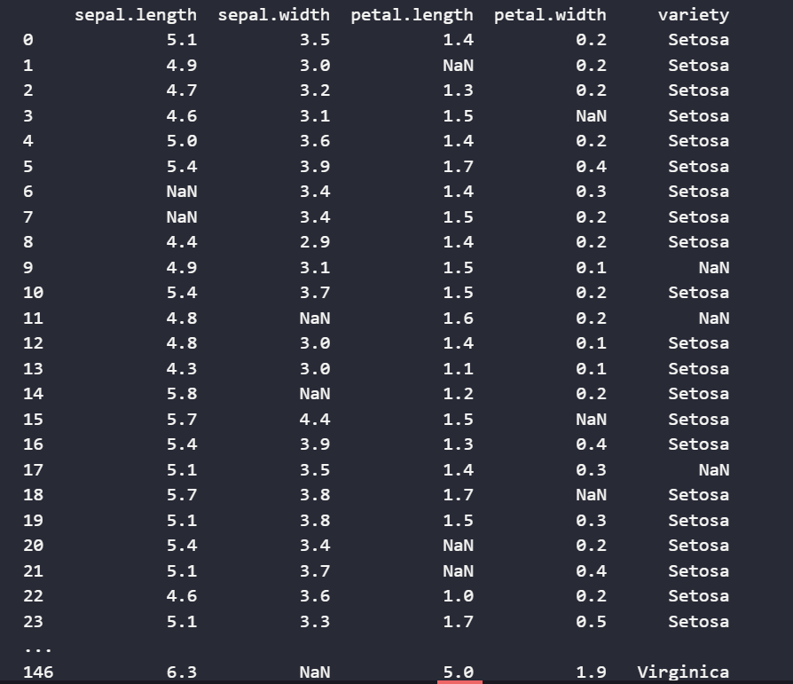
### 2. Điền các giá trị bị thiếu của dữ liệu theo phương pháp trung bình với các trường có giá trị số và theo phương pháp tần số cao nhất với giá trị rời rạc
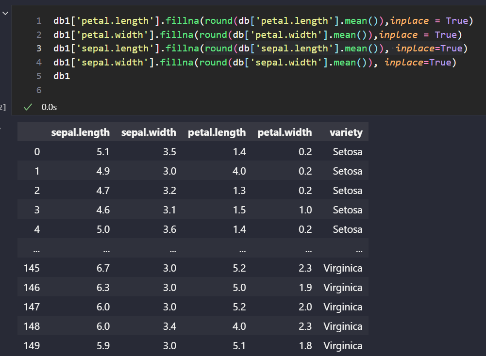
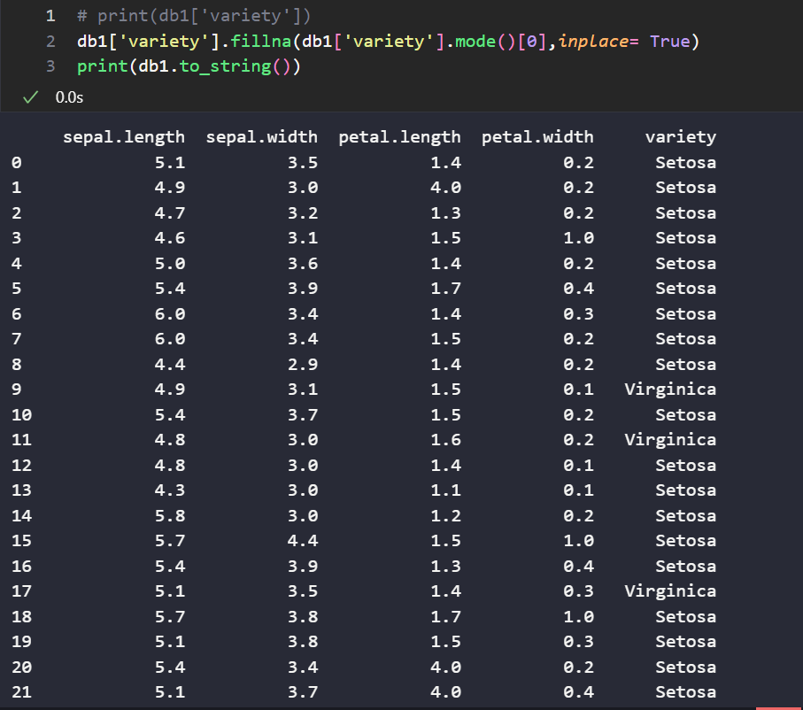
### 3. Hiển thị các bản ghi có sepal.length > 5 và sepal.width > 3
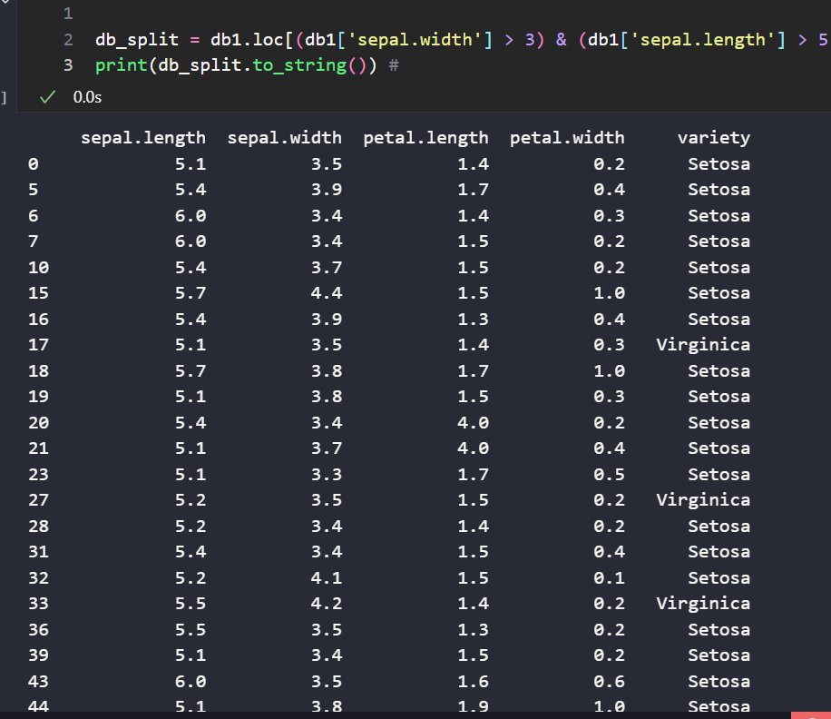
### 4. Chuẩn hóa dữ liệu theo min max
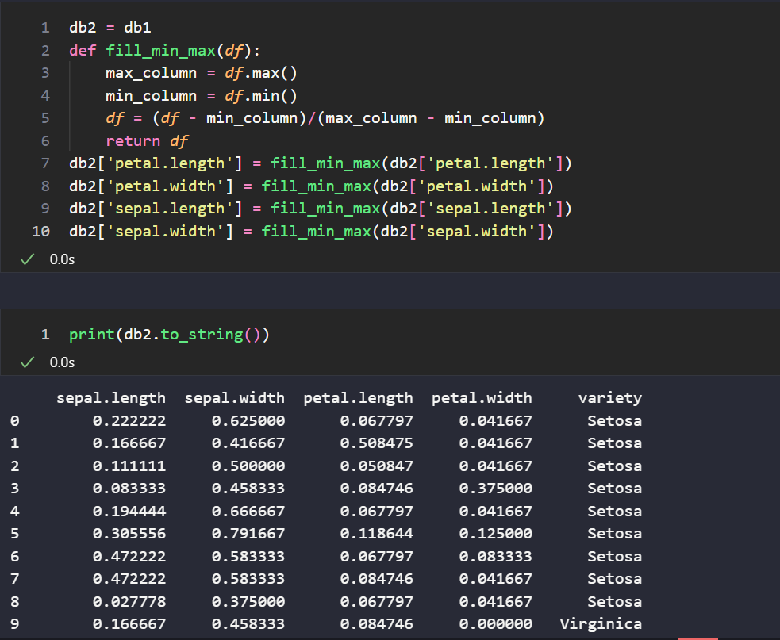
### 5. Liên tục hóa thuộc tính variety
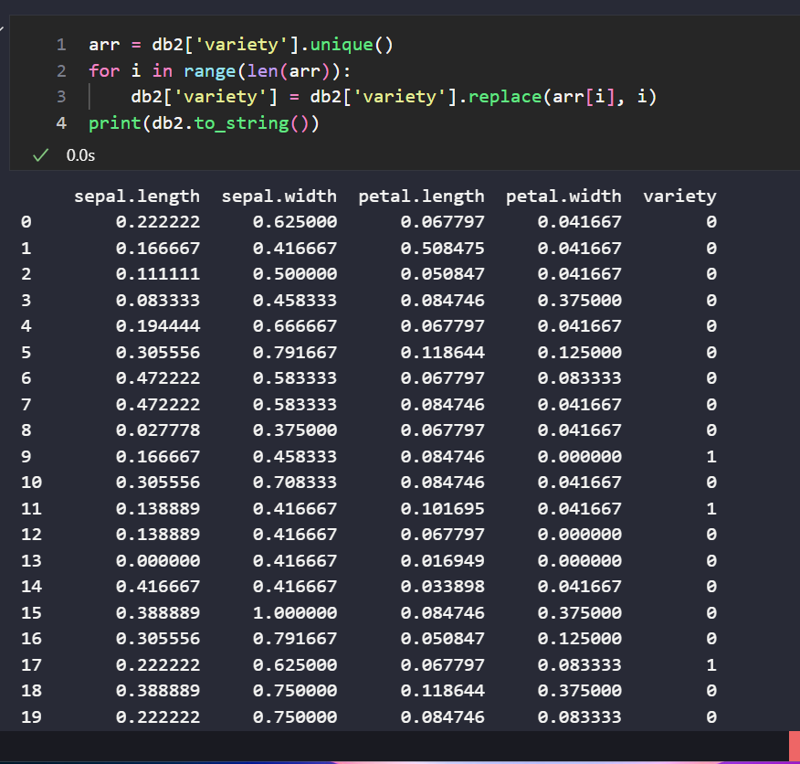
### 6. Xây dựng mô hình hồi quy tuyến tính để đoán kết quả của thuộc tính variety  dựa trên các thuộc tính khác
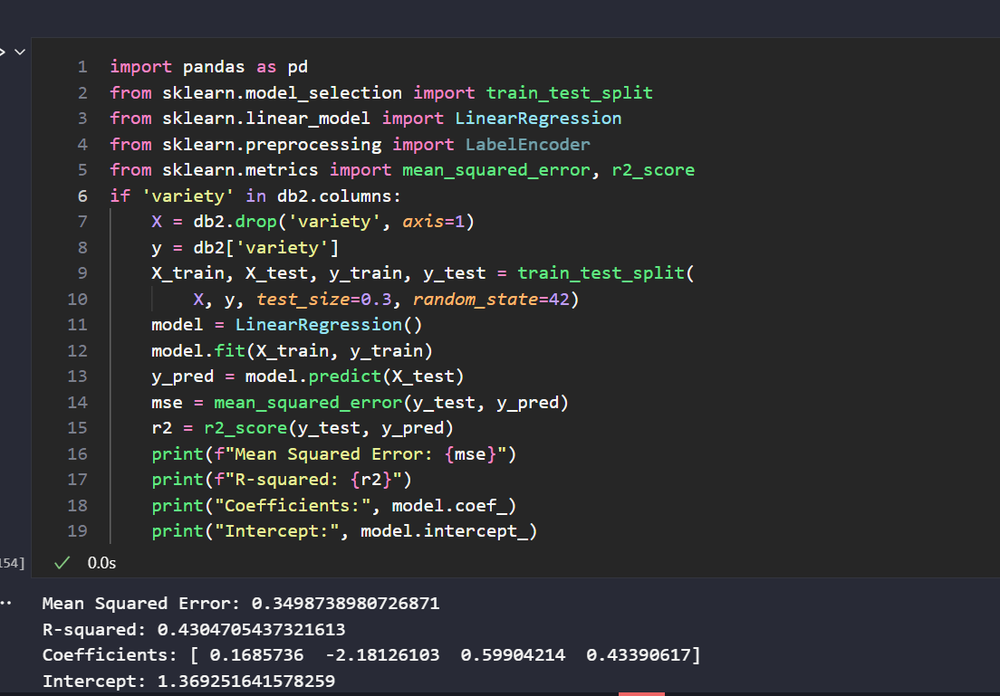
### 7. Lấy mẫu ngẫu nhiên có lặp lại 50% dữ liệu
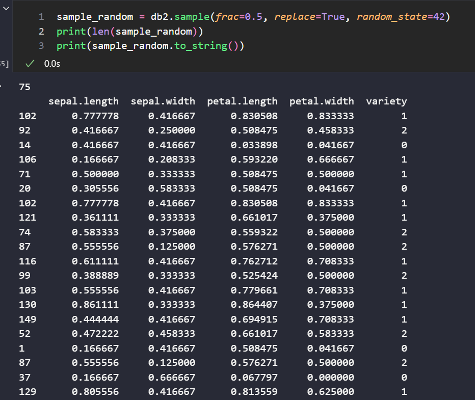
### 8. Rời rạc hóa thuộc tính sepal.length
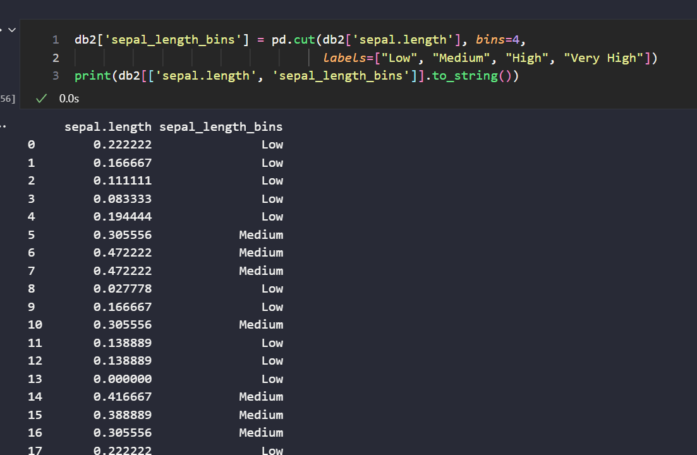
### 9. Phân cụm dữ liệu và loại bỏ ngoại lai 
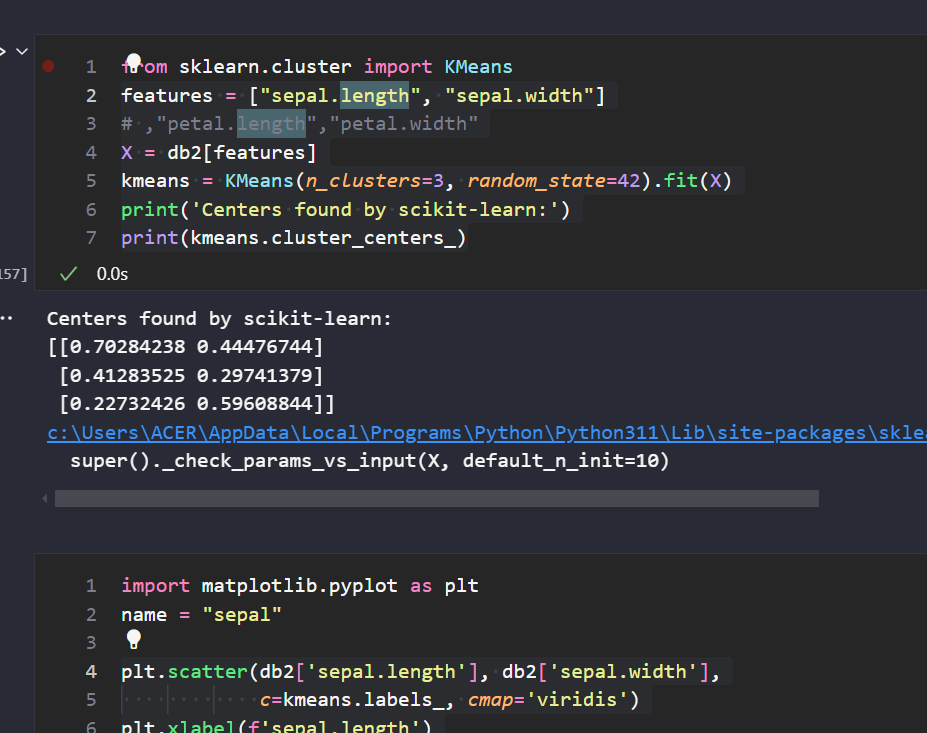
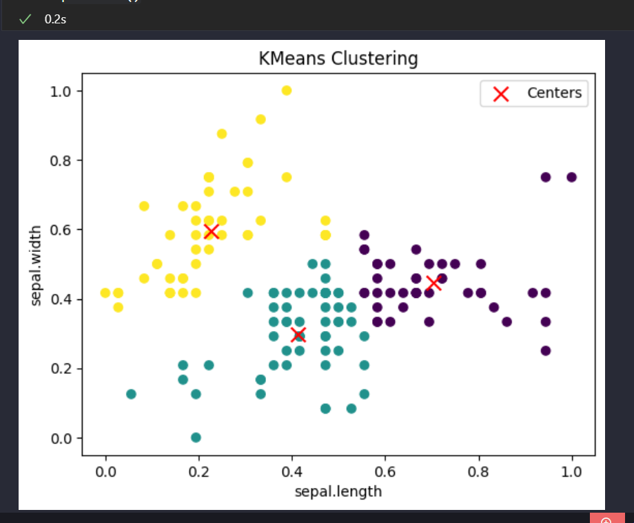
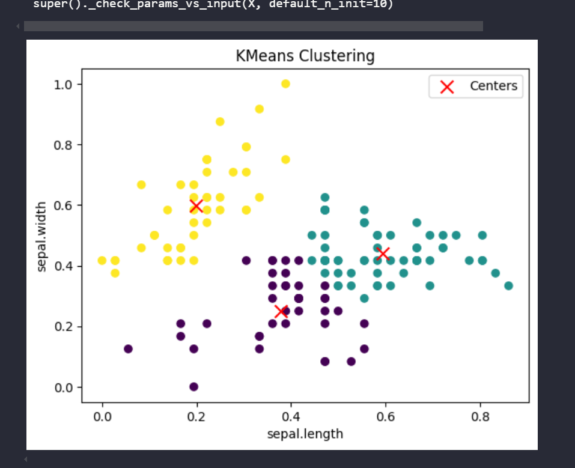